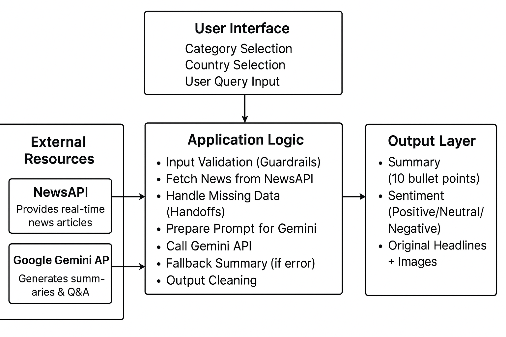
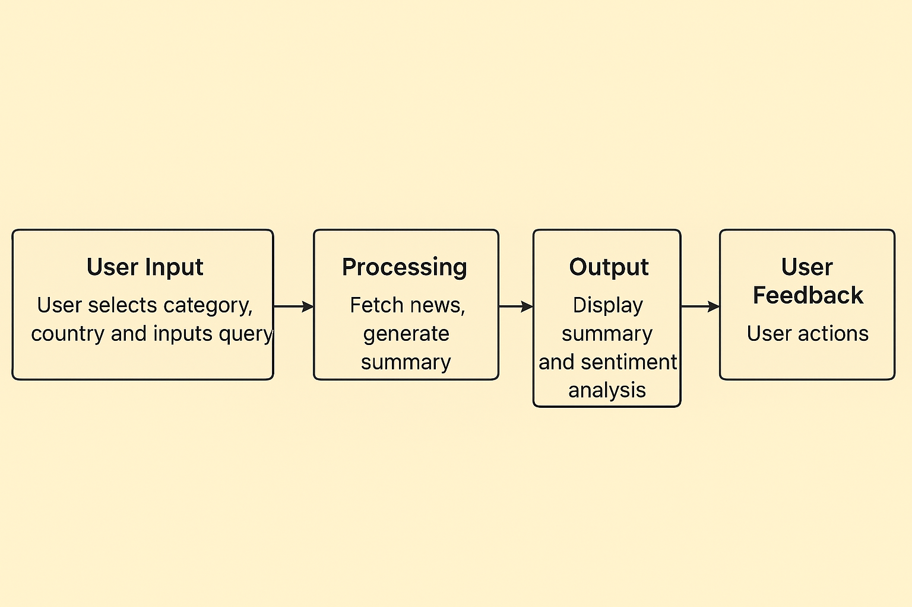
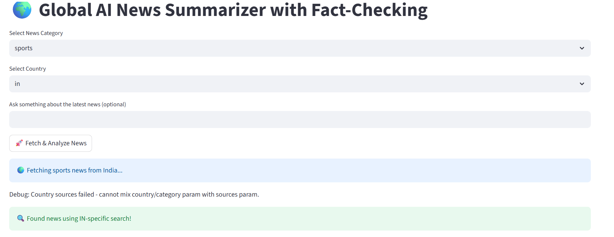
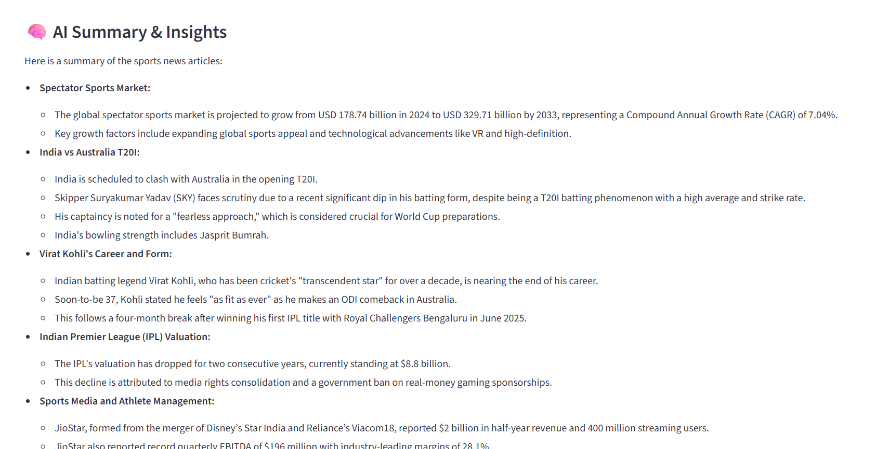
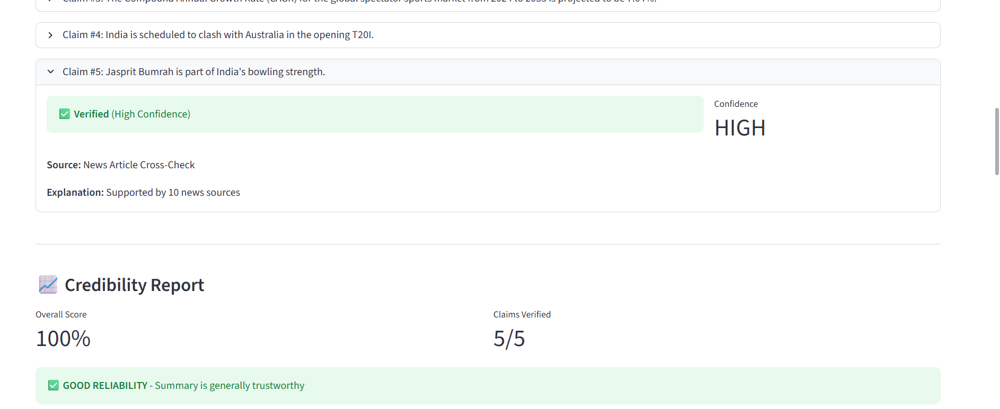

# LLM-Training-Automations
# AI News Summarizer (Google Gemini + Streamlit + Guardrails)

An intelligent AI-powered news summarization system that fetches real-time headlines, applies safety guardrails, and uses Google Gemini to generate structured summaries and sentiment analysis.

This project is built using Streamlit, NewsAPI, and Google Gemini 2.5 Flash, and was developed and debugged using Cursor AI code editor for efficient coding, automation, and LLM integration.

# 🌟Features

* Fetches real-time news from 7 countries (US, IN, UK, CA, AU, DE, FR). category and region.

* Allows custom user queries for specific insights.

* Summarizes with Gemini 2.5 Flash, ensuring factual, neutral results.

* Runs Enhanced Fact-Checking Tool for credibility scoring.

* Produces  key bullet points per summary.

* Uses 5+ AI safety guardrails for reliability and trustworthiness.

* Automatic fallbacks and handoffs if APIs fail.

* Clean, dark-mode Streamlit interface with contrasting text and visuals.

# 🧱 Architecture Overview

# WORKFLOW

🛡️ Guardrails Implemented
#	Guardrail	Description
1️⃣	Input Validation	Blocks special characters & unsafe inputs

2️⃣	Query Length Control	Prevents long/spammy prompts

3️⃣	Token Limit	Restricts text size to model-safe range

4️⃣	Fallback Handling	Switches to general/global news or extractive summary

5️⃣	Output Cleaning	Removes URLs, markup, and unsafe text

6️⃣	Neutrality Enforcement	Gemini instructed to avoid political bias or speculation

# 🔄 Handoffs Implemented

Handoffs ensure graceful degradation when certain steps fail.

1. **Streamlit → NewsAPI**: User selections are handed off to NewsAPI for retrieving relevant articles.  

2. **NewsAPI → Gemini LLM**: Retrieved news data is handed off to Gemini for summarization and sentiment analysis.  

3. **Gemini → Streamlit UI**: The summarized insights are handed off to Streamlit for display to the user.

# TOOLS

| Tool                     | Purpose                                                          |
| :----------------------- | :--------------------------------------------------------------- |
| **Cursor**               | Main AI-assisted IDE for coding, debugging, and LLM integration. |
| **Streamlit**            | Frontend framework for interactive web UI.                       |
| **Google Gemini API**    | Performs text summarization and analysis.                        |
| **NewsAPI**              | Fetches real-time categorized news data.                         |
| **Python-dotenv**        | Manages API keys securely.                                       |
| **Regex + Custom Logic** | Used for guardrails, input validation, and text cleaning.        |

# 🧩 Enhanced Fact-Checking Tool (Main New Component)

<strong>Actions Performed:</strong>

Extracts factual claims from Gemini’s output.

Verifies each claim via three independent methods:

Article cross-checking

Wikipedia REST API search

Gemini-based “common knowledge” validation

Calculates credibility score and generates a visual report.

Displays verified, partially verified, or unverified claims in Streamlit.

# 🎨 User Interface

M🖤 Dark theme (#0f172a) for contrast and clarity

📰 Interactive dropdowns for category and country

📊 Metrics for credibility score and verified claims

🧠 Separate panels for summary, sources, and fact-check results

# ⚙️ Setup
1️⃣ Prerequisites

Python ≥ 3.9

Valid API keys for NewsAPI and Gemini

2️⃣ Installation
git clone https://github.com/SaiPavan-28/LLM-Training-Automations.git
cd ai-news-summarizer
pip install -r requirements.txt

3️⃣ Environment Variables

Create a .env file in the project root:

NEWSAPI_KEY=your_newsapi_key
GEMINI_API_KEY=your_gemini_api_key

4️⃣ Run the App
streamlit run ai_news_summarizer_guarded.py

# 📊 Example Output

Category: Technology
Region: IN
Sentiment: Neutral

1. AI startups in India raised over $100M in funding.
2. Government introduced AI governance framework.
3. Indian universities launch AI-focused programs.
4. Major tech firms open new AI research hubs.
5. AI usage in healthcare continues to rise.
...

  

summary and insights:

# TechStacks

| Component     | Technology              |
| :------------ | :---------------------- |
| Frontend /UI  | Streamlit               |
| Backend Logic | Python                  |
| News Fetch    | NewsAPI                 |
| Summarizer    | Google Gemini 2.5 Flash |
| IDE           | Cursor                  |
| Env Mgmt      | dotenv                  |

# ACESS VEDIO RECORDING
https://drive.google.com/file/d/1Ak4s84T24Le-YZz5RlX7bOmUf69VGWto/view?usp=drive_link

## 📚 References

1. [Google Gemini API Documentation](https://ai.google.dev/)
2. [NewsAPI Documentation](https://newsapi.org/docs)
3. [Streamlit Documentation](https://docs.streamlit.io/)
4. [LangChain Framework](https://www.langchain.com/)
5. [dotenv Python Library](https://pypi.org/project/python-dotenv/)
6. Project idea inspired by real-time AI-powered news summarization tools.

# 🚀 Future Enhancements

Add multi-language summarization using Gemini’s translation.

Include voice-based query input for accessibility.

Enable email summaries for subscribed users.

Integrate Gemini Pro for deeper reasoning and insight generation.
